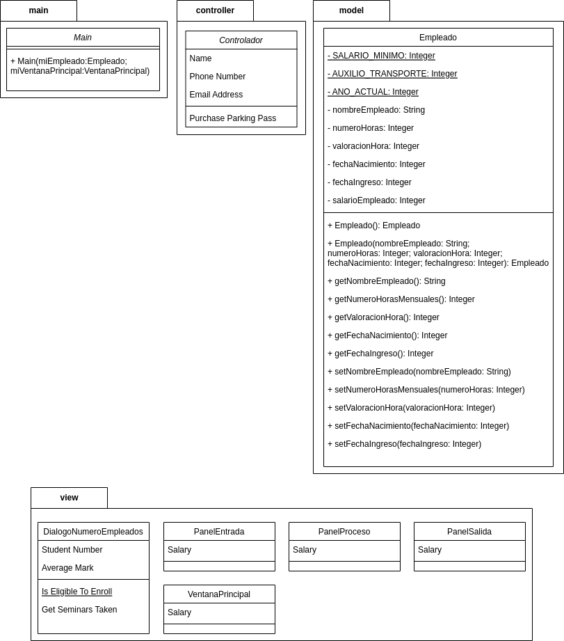

# Caso Empresa

Una empresa desea conocer el total a pagar por concepto de salarios a sus empleados. Cada empleado trabaja un número de horas mensuales, y recibe una valoración por esa hora de trabajo. Si el empleado gana menos de dos salarios minimos, entonces recibe un auxilio de transporte. Adicionalmente, se desea calcular la edad del empleado a partir de su fecha de nacimiento, y la antiguedad del empleado utilizando su fecha de ingreso a la empresa.

# Diagrama de clases

# Capturas de pantalla

